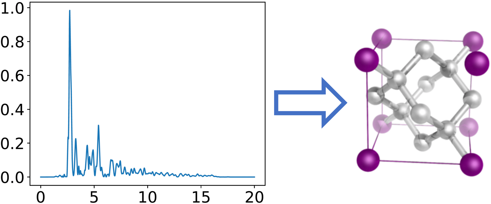

# Overview

<div align=center></div>

This repo contains a **crystal structure dataset** and presents a simple crystal structure classification task, where one is asked to predict some crystal properties given the X-ray diffraction (XRD) patterns. The XRD patterns are collected directly from the [materials project](https://materialsproject.org/) database, or interpolated between different structures.

By default, we provide crystal system labels (7 in total) and space group labels (230 in total). The sample codes based on DNN and LSTM are included in the repo. If you are interested in other material properties like energy, volume, density, we also provide [pymatgen](https://pymatgen.org/index.html) APIs and you only need to input the desired property.

## Requirements
- Python 3
- PyTorch 1.0+
- pymatgen

Older versions might work as well.

## Data

Crystal dataset is stored in `data/crystal_structures.npz`.

To use the dataset,

```python
dataset = np.load('data/crystal_structures.npz')
features = np.array(dataset['xrd'], np.float32)
labels = np.array(dataset['crystal_system'], int)
```

`features` are XRD patterns, which are essentially 1D signals, each with length 2000. The XRD patterns are collected from 5000+ materials. `labels` are properties of interested. The example here is the `crystal_system`  class. One can load `space_group` class similarly.

To obtain other properties,

```python
from pymatgen.ext.matproj import MPRester
mps = np.array(dataset['mp'])
m = MPRester("USER_API_KEY")
labels = []
for mp in mps:
    val = m.query(criteria={"task_id": mp}, properties=[YOUR_PROPERTY])
    labels.append(val)
labels = np.array(labels)
```

`mp` is the material identifier which has already been stored in the dataset.  `USER_API_KEY` can be easily obtained as soon as you register on materials project. Please replace `YOUR_PROPERTY` with the name of the desired property. Some example properties are listed below,

```bash
energy
	Calculated vasp energy for structure
volume
	Final relaxed volume of the material
nelements
	The number of elements in the material
```

The full list of available properties can be found [here](https://docs.materialsproject.org/open-apis/the-materials-api/#basic-properties).

## Run the example codes

We use `crystal_system` classification as our running example.

To train a fully-connected neural network classifier, use the following script:

```bash
./run_fc.sh
```
If you want to train on other properties, please run:

```bash
python fc_csc.py YOUR_PROPERTY
```

Similarly, to train an LSTM classifier, use the following script:

```bash
./run_lstm.sh
```
The default hyper-parameters should give ~ 80% test accuracy.

If you have any questions, feel free to open an issue.

## Cite our paper

If you find our dataset or this repo helpful, please cite our work. Thx!

```
@inproceedings{bai2019imitation,
  title={Imitation Refinement for X-ray Diffraction Signal Processing},
  author={Bai, Junwen and Lai, Zihang and Yang, Runzhe and Xue, Yexiang and Gregoire, John and Gomes, Carla},
  booktitle={ICASSP 2019-2019 IEEE International Conference on Acoustics, Speech and Signal Processing (ICASSP)},
  pages={3337--3341},
  year={2019},
  organization={IEEE}
}
```
